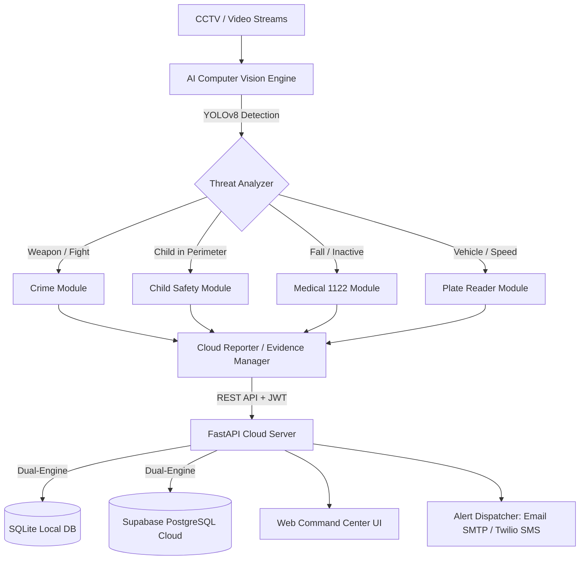

# 🛡️ AI Safety & Surveillance Command Center

[](https://www.python.org/)
[](https://fastapi.tiangolo.com/)
[](https://docs.ultralytics.com/)
[](https://opencv.org/)
[](https://render.com)
[](https://www.docker.com/)

An AI-powered multi-camera surveillance and incident response system designed for school campuses, public areas, and smart city infrastructure. It integrates real-time computer vision threat detection (weapons, fighting, child danger zones, falls) with a unified FastAPI backend, SQLite/Supabase persistence, and a real-time web command center.

---

## 🌟 Key Capabilities & Modules

| Module | Core Technology | Threat Detection & Actions |
| :--- | :--- | :--- |
| 🚸 **Child Safety & Virtual Fence** | YOLOv8 + Polygon Zone Mapping | Detects unsupervised children entering danger zones (roads, pools, gates); triggers parent/guard sirens. |
| 🔪 **Crime & Weapon Detection** | YOLOv8 + Custom Weapon Weights | Detects firearms, knives, physical fights, and snatching; flags critical incidents for operator verification. |
| 🚗 **Hit & Run / Vehicle Tracker** | ByteTrack + OCR Plate Reader | Tracks vehicle intrusions, captures license plates, and logs timestamps for forensic evidence. |
| 🚑 **Medical / Fall Emergency** | Pose Estimation (Keypoints) | Detects unresponsive individuals lying down $>30\text{s}$; triggers 1122 emergency ambulance alerts. |
| 🖥️ **Command Center & Alerts** | FastAPI + Web UI + SMTP/Twilio | Real-time incident verification, emergency dispatch (SMS/Email), camera management, and analytics. |

---

## 📐 System Architecture



---

## 🚀 Quick Start (Local Setup)

### 1. Clone & Setup Environment
```bash
git clone https://github.com/natiq-ali-hamiya/ai-safety-monitor.git
cd ai-safety-monitor

# Create and activate Python virtual environment
python -m venv venv
# On Windows:
.\venv\Scripts\activate
# On Linux / macOS:
source venv/bin/activate

# Install core backend & web dependencies
pip install -r requirements.txt
```

### 2. Start the Backend & Web Dashboard
```bash
python -m uvicorn main:app --host 127.0.0.1 --port 8000 --reload
```
Open your browser and navigate to:
👉 **`http://127.0.0.1:8000`**

### 3. Pre-Configured Demo Credentials
| Role | Email | Password |
| :--- | :--- | :--- |
| **System Admin** | `admin@aisafety.pk` | `secret` |
| **Chief Operator** | `operator@aisafety.pk` | `secret` |

*(You can also use the 1-click **"⚡ Quick Login"** buttons on the login screen!)*

---

## 🎥 Running Local Computer Vision Video Processing

To run live CCTV detection with your webcam or video feed:

```bash
# Install AI / Deep Learning dependencies
pip install -r requirements-ai.txt

# Run multi-module live detector
python main_v3.py
```

---

## ☁️ Free 1-Click Cloud Deployment

### Option A: Deploy to Render (Recommended)
1. Push your repository to GitHub.
2. Sign in to [Render.com](https://render.com).
3. Click **New +** $\rightarrow$ **Web Service** $\rightarrow$ Connect your GitHub repo.
4. Select **Python** runtime:
   - **Build Command**: `pip install -r requirements.txt`
   - **Start Command**: `python -m uvicorn main:app --host 0.0.0.0 --port $PORT`
5. Click **Deploy Web Service** — your app will be live at `https://your-app-name.onrender.com`!

### Option B: Deploy with Docker / Railway
```bash
docker build -t ai-safety-monitor .
docker run -p 8000:8000 ai-safety-monitor
```

---

## 📡 REST API Summary

| Method | Endpoint | Description | Auth Required |
| :--- | :--- | :--- | :--- |
| `GET` | `/` | Serves Interactive Command Center Web UI | No |
| `GET` | `/health` | Cloud health check & database state | No |
| `POST` | `/auth/login` | Authenticate user & receive JWT Bearer token | No |
| `POST` | `/auth/register` | Register new operator (Admin only) | Bearer (Admin) |
| `GET` | `/incidents` | List detected incidents (supports `?status=`) | Bearer |
| `POST` | `/incidents` | Record incident from edge camera | Bearer |
| `PATCH` | `/incidents/{id}/review` | Update incident status (`confirmed`, `false_alarm`, `resolved`) | Bearer |
| `POST` | `/alerts/send` | Dispatch emergency alert via Email/SMS | Bearer |
| `GET` | `/cameras` | Retrieve registered active CCTV cameras | Bearer |
| `GET` | `/dashboard/stats` | Summary statistics (Threats, Pending, Resolved) | Bearer |
| `POST` | `/demo/simulate-incident` | Generate simulated incident for testing & viva | Bearer |

---

## 🎓 University Presentation & Defense Guide

### Key Questions & Answers for Viva

1. **How does the system prevent network lag from dropping frames?**
   - The computer vision engine (`main_v3.py`) captures frames in a dedicated thread, while incident uploading (`cloud_reporter.py`) runs asynchronously in a non-blocking queue. This ensures zero FPS drop on CCTV streams.

2. **How does database persistence work both offline and online?**
   - The backend uses an automated Dual-Database abstraction in [`main.py`](main.py). If internet access or Supabase credentials are unavailable, it automatically switches to local SQLite (`safety_monitor.db`) with zero code configuration.

3. **How does the system distinguish children from adults?**
   - The `age_estimator.py` module uses keypoint body proportions (head-to-torso ratio and height heuristics) combined with facial analysis to estimate age and trigger special precautions for children under 15 entering danger zones.

---

## 📄 License
MIT License. Developed for University Academic Research & Final Year Project Submission.
